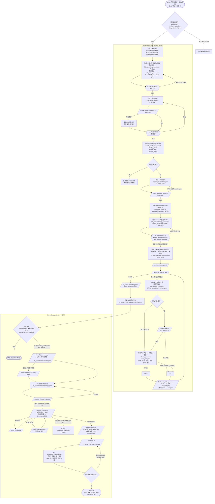

# Dating Diary Skills

《Dating Diary》短剧的生产流水线，由两个 skill 接力，在 **Codex** 中运行：

| Skill | 负责 |
|---|---|
| `dating-diary-preproduction` | 素材清洗 → 原创改编 → 剧本（含台词时长校验）→ 分镜 → 资产登记 → Reference Routing → Anchor → image2 批量关键帧（状态文件 + 自动 QC + 有上限的重跑）→ 前期交付包 |
| `dating-diary-production` | 读取交付包 → 自动分段与参考图路由 → MiniMax H3 视频提示词（带校验）→ 云端 ComfyUI 批量生成多个 take → 下载 → 自动选 take → 粗剪 |

前期 skill 本身不碰视频；视频阶段由 production skill 读取 `preproduction_manifest.json` 接手。

## 人工 Gate

整条流水线只有 3 个人工判断点：

- **Gate 01：改编方向**
- **Gate 02：最终剧本**
- **Gate 03：Reality / Fantasy Anchor**

Anchor 批准后，关键帧、QC、重跑、分段、视频生成、选 take、粗剪全部自动进行。自动重跑 3 次仍不合格的关键帧会进入异常列表，不阻塞流水线，之后由人处理。

## 完整流程图

菱形为判断，六边形为人工 Gate，平行四边形为 `scripts/` 里的脚本，矩形为模型执行的步骤。



## 仓库结构

```
AGENTS.md                         # Codex 的总规则（Gate、状态文件、脚本优先……）
skills/
├── dating-diary-preproduction/
│   ├── SKILL.md
│   ├── references/               # series-bible / prompt-library / schemas / qc-and-packaging
│   └── scripts/
│       ├── check_dialogue_timing.py   # 台词最短时长，剧本和分镜都要过
│       ├── keyframe_state.py          # 关键帧进度、重跑上限（3 次）、异常列表
│       └── face_check.py              # 关键帧 vs 角色设定图的人脸相似度（写实镜头）
└── dating-diary-production/
    ├── SKILL.md
    ├── comfy.config.example.json
    ├── references/               # video-prompt / comfy-setup / post-production
    └── scripts/
        ├── build_segments.py          # 分段 + 参考图路由
        ├── validate_video_prompts.py  # 提示词与分段逐项核对
        ├── comfy_run.py               # 上传、提交、断点续跑、下载
        ├── pick_takes.py              # 按人物一致性选 take
        └── assemble.py                # 粗剪 + production manifest
tests/
├── mock_comfy.py                 # 假 ComfyUI 服务器
├── fixture_workflow_api.json     # 模拟的 API 格式工作流
└── e2e_test.py                   # 整条视频链路的端到端测试
```

## 安装

依赖：Python 3.9+、ffmpeg。人脸相关的两个脚本另需 `pip install -r requirements-optional.txt`。

### Codex

在本仓库（或以它为子目录的工作区）里打开 Codex，`AGENTS.md` 会引导它读取两个 SKILL.md。

如果你的 Codex 版本支持全局 skills 目录，也可以复制过去：

```bash
cp -R skills/dating-diary-preproduction skills/dating-diary-production ~/.codex/skills/
```

### Claude Code

```bash
cp -R skills/dating-diary-preproduction skills/dating-diary-production ~/.claude/skills/
```

## 连接云端 ComfyUI

见 `skills/dating-diary-production/references/comfy-setup.md`。简要步骤：

1. 浏览器打开 `https://你的ComfyUI地址/system_stats`，确认能返回 JSON。
2. ComfyUI 菜单 **Workflow → Export (API)**，保存为 `workflows/minimax_h3_api.json`。
3. `cp skills/dating-diary-production/comfy.config.example.json comfy.json`，填 `base_url`（或设环境变量 `COMFY_URL`）。
4. `python3 skills/dating-diary-production/scripts/comfy_run.py inspect --config comfy.json --write`，核对节点编号。
5. `python3 skills/dating-diary-production/scripts/comfy_run.py check <集目录> --config comfy.json`。

ComfyUI 默认没有登录验证，不要把它裸露在公网上。

## 使用示例

- 「把这段素材改成 Dating Diary A 切片，女主 F01，男主 M03，场景 S01。」
- 「剧本定了，继续。」
- 「Anchor 可以，继续到粗剪。」
- 「继续 ep03。」（从状态文件恢复）
- 「G3 换第二个 take，重新拼粗剪。」

## 设计原则

- 借真实经历的观察，不复刻真实个人；原始素材不进 git。
- 男嘉宾在笑点发生前应看起来真实、正常、体面。
- 女主喜剧感来自微反应与脑内高速运转，而不是夸张嫌弃。
- Reality 与 Fantasy 使用不同视觉语言和 reference 系统；Q版视频段不接写实参考图。
- 每个镜头先作为**一张静态关键帧**成立。
- 所有 reference 都通过 asset_id 管理；人物身份特征只来自角色 `profile.json`。
- 连续性优先用规则和脚本控制，而不是每次让模型自由判断。
