# Dating Diary Skills

《Dating Diary》短剧的生产流水线，由两个 skill 接力，在 **Codex** 中运行：

| Skill | 负责 |
|---|---|
| `dating-diary-preproduction` | 素材清洗 → 原创改编 → 剧本（含台词时长校验）→ 分镜 → 资产登记 → Reference Routing → Anchor → image2 批量关键帧（状态文件 + 自动 QC + 有上限的重跑）→ 前期交付包 |
| `dating-diary-production` | 读取交付包 → 自动分段与参考图路由 → MiniMax H3 视频提示词（带校验）→ 云端 ComfyUI 批量生成多个 take → 下载 → 自动选 take → 粗剪 |

前期 skill 本身不碰视频；视频阶段由 production skill 读取 `preproduction_manifest.json` 接手。

## 人工 Gate

整条流水线只有 3 个人工判断点：

- **Gate 01：改编方向**
- **Gate 02：最终剧本**
- **Gate 03：Reality / Fantasy Anchor**

Anchor 批准后，关键帧、QC、重跑、分段、视频生成、选 take、粗剪全部自动进行。自动重跑 3 次仍不合格的关键帧会进入异常列表，不阻塞关键帧生成；但视频阶段要求每个镜头都有定稿关键帧，所以有异常时会在进入视频前停下，等你挑图或补图（见使用教程第 11 步）。这不是新的 Gate，只是出错后的处理。

## 完整流程图

菱形为判断，六边形为人工 Gate，平行四边形为 `scripts/` 里的脚本，矩形为模型执行的步骤。

```mermaid
flowchart TD
    IN(["输入：已筛选素材 + 改编要求<br/>女主 / 男主 / 场景 ID"]) --> RESUME{"已有状态文件？<br/>project.json / keyframe_state.json<br/>10_production/*.json"}
    RESUME -- "有：继续 &lt;集名&gt;" --> JUMP["从未完成的阶段继续"]
    RESUME -- "没有" --> S0

    subgraph PRE["dating-diary-preproduction（前期）"]
        direction TB
        S0["阶段 0 建立项目<br/>00_meta/project.json<br/>按 ID 读取 assets/ 的 profile.json 与参考图"]
        S0 --> S1["阶段 1 素材清洗与原创改编<br/>原始素材 → 01_source/original_source.*（不进 git）<br/>去识别化 → adaptation_notes.md<br/>3–5 个改编方向 + visual gag"]
        S1 --> G1{{"HUMAN GATE 01<br/>改编方向"}}
        G1 -- "未选定：停下等待" --> S1
        G1 -- "批准" --> S2["阶段 2 最终剧本<br/>02_script/script.md + script.json"]
        S2 --> T1[/"check_dialogue_timing.py<br/>script.json"/]
        T1 -- "时长不够" --> T1F["写明实际所需秒数<br/>附一版精简台词"]
        T1F --> G2
        T1 -- "OK" --> G2{{"HUMAN GATE 02<br/>最终剧本"}}
        G2 -- "修改" --> S2
        G2 -- "批准" --> S3["阶段 3 资产登记与缺口分析<br/>female_lead / male_date / reality_scene<br/>q_chibi_style / special_props"]
        S3 --> MISS{"关键资产缺失？"}
        MISS -- "是" --> MISSOUT["只输出最小补充清单<br/>不擅自补造参考图"]
        MISS -- "否" --> S4["阶段 4 拆分镜头<br/>03_storyboard/shots.json（5–8 镜，≤10）"]
        S4 --> T2[/"check_dialogue_timing.py<br/>shots.json"/]
        T2 -- "FAIL：只调 duration_hint" --> S4
        T2 -- "PASS" --> S5["阶段 5 Reference Routing<br/>每镜写入 reference_asset_ids<br/>Fantasy 不接 Reality 餐厅图"]
        S5 --> S6["阶段 6 image2 生成 Anchor<br/>06_anchors/reality_anchor.png<br/>fantasy_anchor.png（如有）<br/>+ 阶段 8 QC"]
        S6 --> G3{{"HUMAN GATE 03<br/>Reality / Fantasy Anchor<br/>状态 awaiting_approval"}}
        G3 -- "修改意见：重生成" --> S6
        G3 -- "批准（之后自动跑到粗剪）" --> S7["阶段 7 编译每镜 Image Prompt<br/>MASTER + 角色块 + 场景块 + 镜头块<br/>05_prompts/image_prompts.json / shot_XX.txt"]

        S7 --> KINIT[/"keyframe_state.py init"/]
        KINIT --> KNEXT[/"keyframe_state.py next"/]
        KNEXT -- "DONE" --> KSTAT[/"keyframe_state.py status<br/>汇总 + exception 列表"/]
        KNEXT -- "下一镜 + 尝试次数 N" --> KGEN["image2 一次生成一张<br/>重跑时追加 regeneration_instruction<br/>07_keyframes/shot_XX_tryN.png"]
        KGEN --> QCTYPE{"写实人物镜头？"}
        QCTYPE -- "是" --> FACE[/"face_check.py<br/>对比角色设定图"/]
        QCTYPE -- "Q版：跳过人脸" --> QCLIST
        FACE -- "低于阈值" --> QFAIL["FAIL"]
        FACE -- "通过" --> QCLIST["阶段 8 清单层 QC（独立子任务）<br/>identity_anchors / must_not_have<br/>服装 · 场景 · 镜头 · 瑕疵 · 真人与商标"]
        QCLIST -- "PASS" --> QPASS["PASS"]
        QCLIST -- "FAIL（最多修 3 个问题）" --> QFAIL
        QPASS --> KREC[/"keyframe_state.py record<br/>PASS → 复制为 shot_XX.png<br/>第 3 次 FAIL → exception"/]
        QFAIL --> KREC
        KREC --> KNEXT

        KSTAT --> S9["阶段 9 前期交付包<br/>09_handoff/preproduction_manifest.json"]
    end

    S9 --> PRECHK

    subgraph PROD["dating-diary-production（视频）"]
        direction TB
        PRECHK{"前置条件<br/>manifest 存在 · 关键帧文件齐全<br/>comfy_run.py check 通过<br/>（面板在线 · 有卡 · ComfyUI 已启动 · 卡片存在 · 槽位够用）"}
        PRECHK -- "缺项（如 exception 镜头还没有定稿关键帧）" --> STOP(["停下，告诉用户缺什么"])
        PRECHK -- "通过（handoff_ready=false 时汇报写明）" --> P1[/"P1 build_segments.py<br/>分段 + 参考图路由<br/>→ 10_production/segments.json"/]
        P1 -- "参考图多于槽位（U01 为 4）" --> P1R[/"build_segments.py --max-refs N"/]
        P1R --> P2
        P1 --> P2["P2 编写视频提示词<br/>10_production/prompts/G{n}.json"]
        P2 --> V[/"validate_video_prompts.py"/]
        V -- "ERROR" --> P2
        V -- "通过（WARNING 逐条确认）" --> P3[/"P3 comfy_run.py run<br/>每段默认 3 个 take，逐个进行：<br/>清显存 → 提交 → 等完成 → 下载到 11_renders/G{n}/"/]
        P3 -- "中途断开：再跑 run" --> P3
        P3 -- "lost：ComfyUI 重启过" --> P3L["记为 error<br/>下次 run 自动补交"]
        P3L --> P3
        P3 -- "node_errors" --> INSPECT[/"comfy_run.py inspect<br/>重新核对节点"/]
        INSPECT --> P3
        P3 -- "执行报错" --> P3E["记录到 production_state.json<br/>同段失败超过 2 次停止补交<br/>汇报用户"]
        P3 -- "全部下载完成" --> P4A[/"P4 pick_takes.py<br/>现实段按人物相似度选 take<br/>Q版段取第一条 → selection.json"/]
        P4A --> P4B[/"assemble.py<br/>→ 12_rough_cut/rough_cut.mp4"/]
        P4B --> P5["P5 production_manifest.json<br/>+ 汇报：段数/时长 · 选中 take · 待处理问题 · 粗剪位置<br/>提醒到 AutoDL 关机停止计费"]
        P5 --> SWAP{"用户要换某段 take？"}
        SWAP -- "改 selection.json<br/>locked: true" --> P4B
        SWAP -- "否" --> DONE(["粗剪完成<br/>配乐 / 字幕 / 配音见 post-production.md"])
    end
```



## 仓库结构

```
AGENTS.md                         # Codex 的总规则（Gate、状态文件、脚本优先……）
skills/
├── dating-diary-preproduction/
│   ├── SKILL.md
│   ├── references/               # series-bible / prompt-library / schemas / qc-and-packaging
│   └── scripts/
│       ├── check_dialogue_timing.py   # 台词最短时长，剧本和分镜都要过
│       ├── keyframe_state.py          # 关键帧进度、重跑上限（3 次）、异常列表
│       └── face_check.py              # 关键帧 vs 角色设定图的人脸相似度（写实镜头）
└── dating-diary-production/
    ├── SKILL.md
    ├── comfy.config.example.json
    ├── references/               # video-prompt / comfy-setup / post-production
    └── scripts/
        ├── build_segments.py          # 分段 + 参考图路由
        ├── validate_video_prompts.py  # 提示词与分段逐项核对
        ├── comfy_run.py               # zealman 面板 / 裸 ComfyUI：上传、逐个提交、断点续跑、下载
        ├── pick_takes.py              # 按人物一致性选 take
        └── assemble.py                # 粗剪 + production manifest
tests/
├── mock_comfy.py                 # 假 ComfyUI + 假 zealman 面板
├── fixture_workflow_api.json     # U01 MiniMax H3 参考转视频工作流（API 格式）
└── e2e_test.py                   # 整条视频链路的端到端测试
```

## 使用教程

下面按一集从零到粗剪的顺序写。你要做的事只有这几类：**一次性准备**、**给素材**、**在 3 个 Gate 上做判断**、**处理 exception**（如果有）、**验收粗剪**。其余步骤由 Codex 按两个 SKILL.md 调用脚本完成。

### 第 0 步：一次性准备

#### 0.1 本机环境

| 需要 | 用途 | 检查 |
|---|---|---|
| Python 3.9+ | 所有脚本 | `python3 --version` |
| ffmpeg / ffprobe | 粗剪、测试 | `ffmpeg -version` |
| （可选）InsightFace 等 | 写实关键帧的人脸比对、按人脸自动选 take | `pip install -r requirements-optional.txt` |

不装可选依赖也能跑完全程，只是会少两样：关键帧 QC 只做清单层检查，没有人脸相似度打分；选 take 时每段直接取第一条。

装好后跑一次自测，确认脚本在你的机器上能用：

```bash
python3 tests/e2e_test.py      # 最后一行是 ALL OK 即可
```

#### 0.2 在 Codex 里打开仓库

```bash
git clone <本仓库地址> dating-diary && cd dating-diary
codex        # 或用 Codex 桌面端打开这个目录
```

Codex 会自动读 `AGENTS.md`，再由它引导去读两个 SKILL.md，不需要额外安装。如果你的 Codex 版本支持全局 skills 目录，也可以把两个 skill 复制过去：

```bash
cp -R skills/dating-diary-preproduction skills/dating-diary-production ~/.codex/skills/
```

需要注意两点：

- **允许联网。** 视频阶段要访问云端面板。Codex 的沙箱默认可能不允许联网，需要在 Codex 设置里打开，或者在它请求时批准。
- **建议用本地 Codex 跑视频阶段。** 视频会下载到 Codex 所在机器的项目目录，而 `11_renders/`、`12_rough_cut/` 不进 git。如果用 Codex 云端任务，文件留在云端容器里，需要另外取回。

Claude Code 也能用：`cp -R skills/dating-diary-preproduction skills/dating-diary-production ~/.claude/skills/`。

#### 0.3 准备角色 / 场景库

角色图和场景图放在仓库根目录的 `assets/` 下。Codex 开一集时按 ID 读取，并把用到的资产复制到本集的 `04_assets/`：

```
assets/
├── characters/
│   ├── F01/              # 女主
│   │   ├── model_sheet.png   # 角色设定图（多角度），人脸比对和视频参考都用它
│   │   ├── closeup.png
│   │   ├── fullbody.png
│   │   ├── chibi_sheet.png   # （可选）Q版形象
│   │   └── profile.json
│   └── M03/ …            # 男嘉宾
├── scenes/S01/     anchor.png  empty_scene.png  scene.json
├── styles/q_chibi_v01/   style_reference.png  style.json
└── props/<道具ID>/   reference.png  prop.json
```

`profile.json` 是人物身份的**唯一来源**（完整格式见 `skills/dating-diary-preproduction/references/schemas.md`），关键字段：

| 字段 | 作用 |
|---|---|
| `appearance_block_en` | 一段英文外貌描述，关键帧和视频提示词都原样复用 |
| `identity_anchors` | 必须出现的特征，QC 逐条核对 |
| `must_not_have` | 必须不出现的特征，例如 `glasses`。不写的话，模型可能从别的角色带进来 |
| `wardrobe.default` / `episode_overrides` | 默认服装和某一集的专属服装 |
| `chibi_asset_id` | Q版形象（本集有幻想段时用） |

缺的资产不用提前补齐。Codex 在第 4 步会列出一份**最小补充清单**，但不会替你编造参考图。

#### 0.4 连接 AutoDL 上的 ComfyUI（zealman 镜像）

1. AutoDL 控制台用**有卡模式**开机，浏览器打开面板地址（形如 `https://xxx.seetacloud.com:8443`）。
2. 在面板「API 生成」页导入 U01「MiniMax H3 参考转视频」工作流并保存，记下**卡片名**。
3. 在仓库根目录建配置（`comfy.json` 已被 .gitignore 排除）：

   ```bash
   cp skills/dating-diary-production/comfy.config.example.json comfy.json
   # 编辑 comfy.json：把 "workflow_id" 改成上面第 2 条记下的卡片名
   export COMFY_URL="https://你的实例.seetacloud.com:8443"   # 写进 ~/.zshrc 或 ~/.bashrc，不要写进仓库
   ```

4. 检查连接：

   ```bash
   python3 skills/dating-diary-production/scripts/comfy_run.py check --config comfy.json
   ```

   这一步会依次检查：面板在线 → 有 GPU（不是无卡模式）→ ComfyUI 已启动（没启动会自动按 U 系列插件档启动）→ 卡片存在 → 节点映射 → 参考图槽位数（U01 是 4 个）。报错时看末尾的「常见问题」。

面板**没有登录验证**，拿到地址的人就能用你的 GPU，所以地址不要提交到 git，也不要公开。更多细节（接口、槽位、任务丢失、裸 ComfyUI）见 `skills/dating-diary-production/references/comfy-setup.md`。

---

### 前期阶段总览

第 1–12 步是前期：从素材一直做到关键帧和交付包。每一步都有固定的产出文件，全部放在集目录里。Codex 断了也能从这些文件接着做。

| 步骤 | 谁来做 | 产出 |
|---|---|---|
| 1 开一集、放素材 | 你给指令 | `00_meta/project.json`、`01_source/original_source.*`、`04_assets/` |
| 2 素材清洗与改编 → **Gate 01** | Codex 写，你选 | `01_source/adaptation_notes.md` |
| 3 剧本与台词时长校验 → **Gate 02** | Codex 写，你定 | `02_script/script.md`、`script.json` |
| 4 资产登记与缺口分析 | 自动（缺资产时你补） | asset manifest |
| 5 拆分镜头 | 自动 | `03_storyboard/shots.json` |
| 6 Reference Routing | 自动 | 每镜的 `reference_asset_ids` |
| 7 生成 Anchor → **Gate 03** | Codex 生成，你批 | `06_anchors/*.png` |
| 8 编译每镜 Image Prompt | 自动 | `05_prompts/` |
| 9 关键帧生成循环 | 自动 | `07_keyframes/shot_XX_tryN.png` |
| 10 关键帧 QC | 自动（独立检查） | `07_keyframes/keyframe_state.json`、`08_qc/qc_report.json` |
| 11 处理 exception | 你（有 exception 时） | `07_keyframes/shot_XX.png` |
| 12 前期交付包 | 自动 | `09_handoff/preproduction_manifest.json` |

### 第 1 步：准备素材，开一集

#### 素材可以是什么

- 网上的帖子或评论（直接复制文字）；
- 聊天记录（复制文字；截图放进文件夹，让 Codex 读图）；
- 你自己的约会观察或口述，几句话也行；
- 已经写好的剧本，或已经批准过的 Anchor（Codex 会直接复用，不会从头重做）。

先挑好素材：一集只讲**一个**尴尬瞬间或一句话术。素材里有好几个笑点时，拆成几集。

#### 素材放在哪里

- 短素材：直接粘贴在给 Codex 的消息里，Codex 会存成 `01_source/original_source.txt`。
- 多个文件或截图：放进 `episodes/<集名>/01_source/raw/`，在消息里告诉 Codex 位置。

`original_source.*` 和 `01_source/raw/` 都被 .gitignore 排除，**原始素材不会进 git**。后面所有步骤只使用去识别化后的 `adaptation_notes.md`。

#### 开集指令

在一条消息里写清下面几项，缺哪项 Codex 会问你：

| 项目 | 示例 | 说明 |
|---|---|---|
| 集名 | ep05 | 集目录是 `episodes/ep05/` |
| 格式 | A 切片 | A 切片 5–15 秒、一个笑点；B 是中短篇 |
| 女主 ID | F01 | `assets/characters/` 下的目录名 |
| 男主 ID | M03 | 同上 |
| 场景 ID | S01 | `assets/scenes/` 下的目录名 |
| 改编要求 | 笑点落在…、保留一段 Q版脑内小剧场、不要出现… | 你想要的方向和禁区 |
| 素材 | 粘贴或给出文件位置 | |

示例：

> 新建一集 ep05，A 切片。女主 F01，男主 M03，场景 S01。
> 改编要求：笑点落在男嘉宾过度准备的自我介绍上；保留一段 Q版脑内小剧场；不要涉及具体学校。
> 素材如下：（粘贴）

#### Codex 在这一步做什么

1. 建 `episodes/ep05/` 和 `00_meta/project.json`（集名、格式、输入的角色和场景 ID、当前阶段、已批准项）。
2. 保存原始素材。
3. 按 ID 从 `assets/` 读取角色和场景，把用到的资产复制到本集的 `04_assets/`。这样这一集自成一体，以后改了角色库也不影响已做完的集。交付包里的图片路径都相对于集目录。

### 第 2 步：素材清洗与改编 → Gate 01

Codex 按 `references/prompt-library.md` 第 1 节的「素材改编 Agent」处理素材，写出 `01_source/adaptation_notes.md`：

| 部分 | 内容 |
|---|---|
| A. 有价值的观察 | 尴尬瞬间、自我包装、社交话术、言行反差、能字面化的笑点、女主自己也身处其中的荒诞感 |
| B. 需要去识别化的信息 | **只列类别**，不抄原文：真实姓名、学校、公司、精确职位、地点、时间、罕见事件组合、原作者辨识度高的原句 |
| C. 3–5 个原创改编方向 | 用换背景、改职业或学校、重排事件、合并多个 archetype、重写对白、加入女主自嘲等方式原创化 |
| D. 每个方向最强的 visual gag / Q版脑内小剧场 | 用来判断这个方向能不能出画面 |

**Gate 01：你要看的**

- 这个方向调侃的是社交机制，而不是某个真人（系列禁区：人肉、影射个人、职业或学校羞辱、阶层嘲讽、外貌羞辱、「所有某类人都这样」式的结论）；
- 男嘉宾在笑点之前看起来正常、体面，不是反派；
- visual gag 能一眼看懂；
- 看不出原素材里的真人。

**回复方式**

- 选一个：「方向 2，继续。」
- 组合或修改：「用方向 2 的设定，加方向 4 的脑内小剧场，职业改成建筑师。」
- 都不满意：「再给 3 个方向，往 xx 方向想。」
- 你已经有明确方向：开集时直接说「就按这个方向」，这一步会被视为已批准。

### 第 3 步：剧本与台词时长校验 → Gate 02

A 切片的默认规格：5–15 秒，一个核心笑点，一个现实约会瞬间，最多 1–2 段脑内幻想。节奏：

```
正常现实 → 触发句 → 女主微反应 → 硬切 → 脑内幻想 → 硬切 → 平静的现实
```

Codex 只写最终可拍的剧本（不写分镜），输出 `02_script/script.md` 和 `02_script/script.json`：

```json
{"claimed_duration": 8, "lines": [
  {"speaker": "M03", "text": "我其实平时不太用 dating app，是朋友非让我下的。"},
  {"speaker": "F01", "text": "哦，那你朋友挺关心你的。"}
]}
```

然后运行台词时长校验（中文约 4.5 字/秒，英文约 2.5 词/秒，换人说话加停顿）：

```
$ python3 skills/dating-diary-preproduction/scripts/check_dialogue_timing.py episodes/ep05/02_script/script.json
  4.4s  M03: 我其实平时不太用 dating app，是朋友非让我下的。
  2.2s  F01: 哦，那你朋友挺关心你的。
  3.3s  M03: 对，他们说我再不下载，就只能相亲了。

dialogue alone needs ≈ 10.5s (pauses between speakers included; action beats not included)
script claims 8.0s → FAIL: too short for its dialogue
```

校验 FAIL 时，Codex 提交给你的内容里会写明「按台词实际需要约 10.5 秒」，并附一版精简台词。**装不下台词的时长不会写进剧本。**

**Gate 02：你要看的**

- 节奏是否符合上面的结构，笑点是不是来自「字面化」或「言行反差」；
- 女主：不翻白眼、不夸张嫌弃、不看镜头吐槽、不替观众总结；喜剧感来自眼神停顿、轻抿嘴、短暂沉默；
- 男嘉宾：自然、礼貌，他自己相信说的话完全正常；
- 总时长能不能接受（按台词实际需要算）。

**回复方式**：「用精简版，定了。」「第二句改成……，其他定了。」「可以，继续分镜。」

批准后台词就锁定了。后面拆分镜时只调镜头时长，不会再改台词。

### 第 4 步：资产登记与缺口分析（自动，缺资产时要你补）

Codex 检查这一集需要的资产：女主、男嘉宾、现实场景、Q版风格、特殊道具（如果有）。每个资产登记 `asset_id`、类型、用途（`usage`）、禁止用途（`do_not_use_for`）和状态（`missing` / `draft` / `approved`）。角色必须有 `profile.json`，并且写了 `identity_anchors` 和 `must_not_have`。

缺关键资产时，Codex **只列一份最小补充清单然后停下**，例如「M03 缺 `model_sheet.png`；本集有幻想段，需要 Q版风格图」。它不会编造参考图，也不会假装不存在的图已经批准。

你把文件放进 `assets/<类型>/<ID>/`，然后说「资产补好了，继续」。

### 第 5 步：拆分镜头（自动）

按已批准的剧本拆成 5–8 个镜头（最多 10 个），写入 `03_storyboard/shots.json`。

| | 现实层 | Q版层 |
|---|---|---|
| 镜头 | ESTABLISHING / MS / MCU / CU / OTS / POV / REACTION SHOT | 同左，动作更夸张 |
| 焦段 | 50–85mm | 24–50mm |
| 机位 | 眼平，构图自然 | 可以低机位 |
| 动作 | 克制，像生活方式摄影 | 大动作，轮廓清楚，背景一眼说明是哪个幻想世界 |

分镜必须包含：至少一个女主微反应、一个明确的触发句、进入幻想的点、回到现实的点。

每个镜头的关键字段（完整格式见 `references/schemas.md` 第 3 节）：

```json
{
  "shot_id": "03", "layer": "reality", "duration_hint": 3.8,
  "characters": ["M03"], "scene_id": "S01",
  "shot_type": "medium_close_up", "camera": {"angle": "eye_level", "lens": "85mm"},
  "action": "男主略微前倾，自然讲话",
  "dialogue_lines": [{"speaker": "M03", "text": "我其实平时不太用 dating app，是朋友非让我下的。", "lang": "zh"}],
  "est_speech_seconds": 4.4, "sound_hint": "餐厅低声交谈、杯具轻响",
  "emotion": ["natural", "polite"], "visual_goal": "让观众觉得他挺正常",
  "reference_asset_ids": []
}
```

拆完再做一次时长校验。每个镜头的 `duration_hint` 不得小于这一镜台词的说话时长：

```
$ python3 skills/dating-diary-preproduction/scripts/check_dialogue_timing.py episodes/ep05/03_storyboard/shots.json
shot     hint   need  result
01        1.5    0.0  OK
02        2.5    4.4  FAIL (+1.9s)
03        2.0    0.0  OK
```

有 FAIL 时 Codex 只调这一镜的 `duration_hint`，不改台词。`duration_hint` 只是叙事节奏的参考，分镜里不会出现任何视频生成参数。

### 第 6 步：Reference Routing（自动）

每个镜头要带哪些参考图，由固定规则决定，不由模型每镜自由判断（完整规则见 `references/qc-and-packaging.md` 第 1 节）：

| 镜头 | 参考图 |
|---|---|
| 现实层，只有女主 | 女主设定图 + Reality Anchor |
| 现实层，只有男主 | 男主设定图 + Reality Anchor |
| 现实层，男女同框 | 女主设定图 + 男主设定图 + Reality Anchor |
| Q版层 | 出场角色设定图 + Q版风格图 + Fantasy Anchor（已批准时） |
| 任意镜头需要特殊道具 | 另加该道具的参考图 |

另外两条硬规则：Q版镜头**绝不**带现实餐厅图；每张参考图都要写明它的用途，不能写「参考上一张」这种没法追踪的说法。结果写进每个镜头的 `reference_asset_ids`。

### 第 7 步：生成 Anchor → Gate 03

Anchor 是本集的视觉基准，后面的镜头都向它看齐，所以先只生成 Anchor，不生成全部关键帧。

| | Reality Anchor | Fantasy Anchor（本集有幻想段才生成） |
|---|---|---|
| 画面 | 男女主同框 | 本集主要 Q版人物同框 |
| 必须交代 | 桌位、窗户、灯光、桌面陈设 | Q版比例、材质、灯光，核心幻想世界 |
| 作用 | 大多数现实镜头的空间基准 | 定义本集的 Q版世界，visual gag 清楚 |

Codex 用 image2 生成 `06_anchors/reality_anchor.png` 和 `fantasy_anchor.png`，先对它们跑一遍第 10 步的 QC，然后把图连同 QC 结果交给你，状态标为 `awaiting_approval`，停下。

**Gate 03：你要看的**

- 人物：逐条对照 `profile.json` 的 `identity_anchors`（都在吗）和 `must_not_have`（出现了吗）；
- 场景：这是不是后面大多数镜头想要的桌位、窗景和光线；
- 质感：现实层没有磨皮、网红滤镜、偶像剧柔光、广告感；Q版是 3D chibi，不是二维漫画或表情包；
- 画面里没有像真实名人的脸，没有真实品牌或学校的 logo。

**回复方式**

- 修改：「男生头发再短一点，窗外换成夜景，桌上的花去掉。」Codex 按意见重生成后再提交，可以反复改。
- 批准：「Anchor 可以，继续到粗剪。」

> **批准之前先确认 AutoDL 已经开机、`check` 能通过。** 批准后，Codex 会一路跑完关键帧、交付包、视频生成和粗剪，只在出错或有 exception 需要处理时停下。

### 第 8 步：编译每镜 Image Prompt（自动）

这一步只拼装提示词，不重新创作剧情、角色、道具、景别或情绪：

```
现实镜头 = REALITY_MASTER_PROMPT + 出场角色的人物块 + 场景连续性块 + 本镜头块
Q版镜头  = Q_CHIBI_MASTER_PROMPT + 出场角色的人物块 + 本镜头块
```

- 人物块里放的是该角色的 `identity_anchors` 和 `must_not_have`，来自 `profile.json`，模板里不写死任何具体特征（比如眼镜）。
- 输出到 `05_prompts/shot_XX.txt`（每镜一个）和 `05_prompts/image_prompts.json`（含 `reference_asset_ids`，`expected_output: static_keyframe`）。
- 提示词里不会出现视频时长、运动强度、口型或运镜参数。
- 模板原文见 `references/prompt-library.md` 第 4–11 节。想调整整个系列的画风，就改那里。

### 第 9 步：关键帧生成循环（自动）

进度由 `keyframe_state.py` 管理。**一次只生成一张**，每张都立刻做 QC 并记录：

```bash
python3 skills/dating-diary-preproduction/scripts/keyframe_state.py init episodes/ep05     # 只在开始时执行一次
```

循环（Codex 自动执行）：

1. `keyframe_state.py next episodes/ep05` 取下一个任务，全部完成时返回 `DONE`：

   ```json
   {
     "shot_id": "01", "layer": "reality", "attempt": 2, "max_attempts": 3,
     "prompt_file": "05_prompts/shot_01.txt",
     "append_regeneration_instruction": "男主不戴眼镜。其他不变。",
     "previous_issues": ["男主出现了眼镜"],
     "save_as": "07_keyframes/shot_01_try2.png"
   }
   ```

2. 用 image2 生成：提示词取 `prompt_file`；如果是重跑，末尾追加 `append_regeneration_instruction`；参考图按这一镜的 `reference_asset_ids` 附上。
3. 保存到 `save_as` 指定的路径（`shot_XX_tryN.png`）。
4. 做第 10 步的 QC。
5. `keyframe_state.py record episodes/ep05 --shot 01 --file 07_keyframes/shot_01_try2.png --status PASS|FAIL --issues "…" --instruction "…"` 写回结果。
   - PASS：脚本把这张图复制为定稿 `07_keyframes/shot_01.png`；
   - FAIL：下一轮带着修改指令重跑；
   - **同一镜头第 3 次仍 FAIL**：脚本标记为 `exception`，跳到下一镜，不会无限重跑。

`*_try*.png` 重试图不进 git，只有定稿 `shot_XX.png` 会被跟踪。

### 第 10 步：关键帧 QC（自动，与生成分开）

每张关键帧过两层检查。

**① 客观层：人脸相似度（仅写实人物镜头）**

```bash
python3 skills/dating-diary-preproduction/scripts/face_check.py \
  --image episodes/ep05/07_keyframes/shot_03_try1.png \
  --ref   episodes/ep05/04_assets/characters/M03/model_sheet.png
```

任一应出场角色的相似度低于阈值就直接 FAIL，不再讨论。

- 默认阈值 0.45。实测同一角色约 0.55–0.61，不同的男性角色之间也能到 0.39，所以阈值不要低于 0.4。
- 第一集跑完后，用你确认过合格和不合格的关键帧各几张来校准，把结果写进 `00_meta/project.json` 的 `face_threshold`。
- Q版镜头跳过这一层，人脸模型对 chibi 无效。
- 这一层需要可选依赖；没装时只做下面的清单层。

**② 清单层：独立检查**

交给一个只做 QC 的子任务（或者生成结束后单独开一轮），只看图和标准，不看生成时的思路：

| 类别 | 检查什么 |
|---|---|
| 人物身份 | 脸型、五官、身材比例；逐条核对 `identity_anchors` 和 `must_not_have` |
| 服装 | 与本场一致，颜色和关键饰品没变 |
| 场景 | 同一家店，桌椅、窗户位置、光线时间、桌面物品连续 |
| 镜头 | 景别、机位、OTS 是否成立、人物有没有看镜头、动作和人数 |
| 生成瑕疵 | 手、餐具、肢体融合、多余人物、怪文字、错误 logo、AI 塑料脸 |
| 真人与商标 | 没有像名人的脸（包括背景人群），没有真实品牌或学校的 logo |

输出 PASS / FAIL，加四项分数（人物、场景、镜头、画质）。FAIL 时**最多列 3 个最关键的问题**，给出最小修改指令，不重新设计整个镜头：

```
严格恢复参考图中的黑色层次短发和略乱的刘海。男主不戴眼镜（must_not_have: glasses）。
除此之外不要改变画面构图、场景、灯光和人物动作。
```

### 第 11 步：处理 exception（有才需要）

所有镜头处理完后，Codex 运行 `keyframe_state.py status` 汇总，把 exception 镜头列给你：

```
01   pass       tries=1
04   exception  tries=3  男主出现了眼镜
…
exceptions (need a human later): 04
```

exception 不会阻塞关键帧流程，但**视频阶段要求每个镜头都有定稿关键帧**。所以有 exception 时，Codex 会在进入视频阶段前停下，等你处理。三种处理方法：

1. **从已有的尝试里挑一张**：看 `07_keyframes/shot_04_try1~3.png`，说「shot 04 用 try2」。这对应：

   ```bash
   python3 skills/dating-diary-preproduction/scripts/keyframe_state.py resolve episodes/ep05 --shot 04 --file 07_keyframes/shot_04_try2.png
   ```

2. **让 Codex 按你的意见再生成一张**：「shot 04 换个角度，改成过肩镜头，再出一张给我看。」你确认后同样用 `resolve` 定稿。
3. **用你自己的图**：修图或手动生成的图放进 `07_keyframes/`，然后 `resolve`。

`resolve` 会把图复制为 `shot_04.png`，并记录这是人工处理（`resolved_by: human`）。处理完说「exception 处理好了，继续」。

### 第 12 步：前期交付包（自动）

Codex 整理 `09_handoff/preproduction_manifest.json`，内容包括：项目信息、资产（角色设定图和 profile 路径、道具、风格）、Anchor 路径、每个镜头的关键帧、参考图、提示词文件、QC 状态、台词、时长和声音提示、exception 列表。里面**不含任何视频生成参数**。

以下条件全部满足时，才标记 `handoff_ready: true`：

- 剧本已批准，剧本和分镜都通过了台词时长校验；
- 每个镜头都有提示词、`reference_asset_ids` 和经过 QC 的关键帧；
- Reality Anchor（以及有幻想段时的 Fantasy Anchor）已批准；
- 所有 FAIL 的镜头要么重跑通过，要么作为 exception 列出；
- 原始素材没有进入交付包，也没有进入任何 git 跟踪的文件。

前期到这里结束。完成后的集目录：

```
episodes/ep05/
├── 00_meta/project.json
├── 01_source/        adaptation_notes.md   （original_source.*、raw/ 不进 git）
├── 02_script/        script.md  script.json
├── 03_storyboard/    shots.json
├── 04_assets/        characters/  scene/  style/  props/
├── 05_prompts/       image_prompts.json  shot_01.txt …
├── 06_anchors/       reality_anchor.png  fantasy_anchor.png
├── 07_keyframes/     keyframe_state.json  shot_01.png …   （*_try*.png 不进 git）
├── 08_qc/            qc_report.json
└── 09_handoff/       preproduction_manifest.json
```

### 第 13 步：视频生成与下载（自动）

Codex 切换到视频 skill，依次执行：

1. `build_segments.py`：自动分段（现实段和 Q版段分开，每段 ≤ 10 秒），并给每段配参考图。U01 每段最多 4 张参考图，超出时 `check` 会提示用 `--max-refs 4` 重新分段；
2. 按 `references/video-prompt.md` 写每段的 MiniMax H3 JSON 提示词，再用 `validate_video_prompts.py` 校验；
3. `comfy_run.py run`：每段默认 3 个 take，**一个接一个**进行：清显存 → 提交 → 等完成 → **立刻下载到 `11_renders/G{n}/`**；
4. `pick_takes.py` 选出每段最好的 take，`assemble.py` 拼出 `12_rough_cut/rough_cut.mp4`。

生成 10 秒左右的一段要几分钟，一整集要等比较久，这是正常的。想看进度，可以另开一个终端：

```bash
python3 skills/dating-diary-production/scripts/comfy_run.py status episodes/ep05
ls episodes/ep05/11_renders/*/
```

如果不想让 Codex 一直开着等，也可以自己在后台跑生成，跑完再回 Codex 说「继续 ep05」，让它选 take、拼粗剪：

```bash
nohup python3 skills/dating-diary-production/scripts/comfy_run.py run episodes/ep05 --config comfy.json \
  > episodes/ep05/render.log 2>&1 &
```

### 第 14 步：验收粗剪、换 take

Codex 的汇报会包含：分了几段、成片多长、每段选中的 take（有分数时附分数）、需要你处理的问题（前期 exception、生成失败）、粗剪位置。

`pick_takes.py` **只检查人物一致性和长度，不判断表演**，所以请看一遍 `12_rough_cut/rough_cut.mp4`。

想换 take，直接说：「G3 换第二个 take，重新拼粗剪。」也可以手动改 `10_production/selection.json`：

```jsonc
"G3": {
  "file": "11_renders/G3/G3_s123456_00001_.mp4",  // 换成 candidates 里的另一个文件
  "in": 0.0, "out": 5.2,                           // 可选：调整截取的起止秒数
  "locked": true                                   // 锁定后，重跑 pick_takes 也不会覆盖
}
```

改完运行 `python3 skills/dating-diary-production/scripts/assemble.py episodes/ep05`。

某段所有 take 都不满意：「G2 再跑 2 个 take。」`--takes` 是每段的总数，所以已有 3 个时对应 `comfy_run.py run … --only G2 --takes 5`。

### 第 15 步：收尾

- **到 AutoDL 控制台关机**：视频已经全部下载到本地，开着机会一直计费。关机会保留数据，释放实例才会删除数据。Codex 不会替你关机。
- 配乐、字幕、统一配音在剪辑软件里做，见 `skills/dating-diary-production/references/post-production.md`。
- `11_renders/`、`12_rough_cut/` 不进 git，需要长期保存的请放到对象存储或网盘。

---

### 中断与恢复

所有进度都写在集目录的状态文件里（`00_meta/project.json`、`07_keyframes/keyframe_state.json`、`10_production/*.json`）。无论是 Codex 会话断了、上下文被压缩、电脑休眠还是 ComfyUI 重启，都只需要说：

> 继续 ep05

- 前期阶段：从最后一个未完成的阶段或镜头继续，已经通过的 Gate 不会再问。
- 视频阶段：已经提交的任务在服务器上会继续跑完。再次 `run` 时，脚本先把它们等完、下载下来，再补上缺的 take。
- ComfyUI 重启过：服务器已经查不到的任务会被标记为 `lost`，自动补交。
- 同一段失败超过 2 次就不再自动补交，Codex 会停下来汇报原因。

### 常用说法

| 你说 | Codex 做 |
|---|---|
| 「把这段素材改成 Dating Diary A 切片，女主 F01，男主 M03，场景 S01。」 | 开新集，走到 Gate 01 |
| 「方向 2，继续。」 | 通过 Gate 01，写剧本 |
| 「再给 3 个方向，往 xx 方向想。」 | 重新出改编方向 |
| 「用精简版，定了。」 | 通过 Gate 02 |
| 「资产补好了，继续。」 | 重新登记资产，继续拆分镜 |
| 「男生头发再短一点，窗外换成夜景。」 | 按意见重生成 Anchor |
| 「剧本定了，继续。」 | 通过 Gate 02，走到 Gate 03 |
| 「Anchor 可以，继续到粗剪。」 | 通过 Gate 03，一路跑到粗剪 |
| 「shot 04 用 try2。」 | 用 `keyframe_state.py resolve` 定稿这张 |
| 「shot 04 改成过肩镜头，再出一张给我看。」 | 按意见补生成一张，等你确认 |
| 「exception 处理好了，继续。」 | 打包交付，进入视频阶段 |
| 「继续 ep05。」 | 读状态文件，从断点继续 |
| 「G3 换第二个 take，重新拼粗剪。」 | 改 selection.json 并重新 assemble |
| 「G2 再跑 2 个 take。」 | 只给 G2 追加 take |
| 「只重新拼粗剪。」 | 只跑 assemble.py |

### 手动命令速查

以下命令都在仓库根目录执行，`EP=episodes/ep05`。

| 命令 | 作用 |
|---|---|
| `python3 skills/dating-diary-preproduction/scripts/check_dialogue_timing.py $EP/02_script/script.json` | 剧本台词时长校验 |
| `python3 skills/dating-diary-preproduction/scripts/check_dialogue_timing.py $EP/03_storyboard/shots.json` | 每镜时长校验 |
| `python3 skills/dating-diary-preproduction/scripts/keyframe_state.py init $EP` | 初始化关键帧进度（只执行一次） |
| `python3 skills/dating-diary-preproduction/scripts/keyframe_state.py next $EP` | 下一个要生成的镜头、第几次尝试、要追加的修改指令 |
| `python3 skills/dating-diary-preproduction/scripts/keyframe_state.py record $EP --shot 04 --file <图> --status PASS\|FAIL --issues "…" --instruction "…"` | 记录一次 QC 结果 |
| `python3 skills/dating-diary-preproduction/scripts/keyframe_state.py status $EP` | 关键帧进度和 exception 列表 |
| `python3 skills/dating-diary-preproduction/scripts/keyframe_state.py resolve $EP --shot 04 --file <图>` | 人工给 exception 镜头定稿 |
| `python3 skills/dating-diary-preproduction/scripts/face_check.py --image <关键帧> --ref <设定图> [--threshold 0.45]` | 人脸相似度（写实镜头） |
| `python3 skills/dating-diary-production/scripts/comfy_run.py check $EP --config comfy.json` | 检查面板、GPU、卡片、槽位 |
| `python3 skills/dating-diary-production/scripts/comfy_run.py inspect --config comfy.json` | 列出卡片节点和参考图槽位 |
| `python3 skills/dating-diary-production/scripts/build_segments.py $EP [--max-refs 4]` | 分段并配参考图 |
| `python3 skills/dating-diary-production/scripts/validate_video_prompts.py $EP` | 校验视频提示词 |
| `python3 skills/dating-diary-production/scripts/comfy_run.py run $EP --config comfy.json [--only G2] [--takes N]` | 生成并下载 |
| `python3 skills/dating-diary-production/scripts/comfy_run.py wait $EP --config comfy.json` | 只等待、下载已提交的任务 |
| `python3 skills/dating-diary-production/scripts/comfy_run.py status $EP` | 每段 take 状态 |
| `python3 skills/dating-diary-production/scripts/pick_takes.py $EP` | 选 take |
| `python3 skills/dating-diary-production/scripts/assemble.py $EP [--fit pad]` | 拼粗剪 |

### 常见问题

| 现象 | 原因与处理 |
|---|---|
| 台词时长校验总是 FAIL | 台词太长。接受 Codex 给的精简版，或者接受更长的总时长 |
| Codex 停下来列「最小补充清单」 | 缺关键资产。把文件放进 `assets/<类型>/<ID>/`，然后说「资产补好了，继续」 |
| 关键帧反复戴上不该有的眼镜、换了发型 | 把这个特征写进该角色 `profile.json` 的 `must_not_have` 或 `identity_anchors`，再重生成 |
| `face_check.py` 退出码 3 | 没装可选依赖：`pip install -r requirements-optional.txt` |
| `face_check.py` 退出码 4 | 关键帧里没检测到人脸（背影、遮挡、太小），这一镜只做清单层检查 |
| 同一角色的正确关键帧也总被 face_check 判 FAIL | 设定图太小或太模糊，换一张清晰的正脸；或者按第 10 步的方法校准 `face_threshold` |
| `record` 报 `already exception` | 这一镜已经用完 3 次机会，改用 `resolve` 人工定稿 |
| `record` 报 `file not found` | 先保存图片，再记录结果 |
| 视频阶段一开始就停下，说缺关键帧 | 有 exception 镜头还没定稿，按第 11 步处理 |
| `check` 报 `no-GPU mode (无卡模式)` | AutoDL 以无卡模式开的机，回控制台按有卡模式重新开机 |
| `check` 报卡片 `is not saved on the panel` | `workflow_id` 和面板上的卡片名不一致。报错里会列出已保存的卡片，照着改 `comfy.json` |
| `cannot reach …` | 地址不对、实例没开机，或 Codex 沙箱没有联网权限 |
| `FAIL: a segment needs 5 references but the workflow has 4 slots` | 运行 `build_segments.py <集目录> --max-refs 4`，再让 Codex 重写受影响段的提示词。也可以在工作流里多接几个“加载图像”，再重新保存卡片 |
| 提交时报 `unknown input` 或 `node_errors` | 卡片的节点编号变了：删掉 `comfy.json` 里的 `nodes`，运行 `inspect --write` 重新识别 |
| 执行报错（显存不足等） | 已记录在 `production_state.json`，下次 `run` 会补交；同一段失败超过 2 次就停止，查明原因后用 `--retry-failed` |
| 某个任务一直 `queued` 最后变成 `lost` | ComfyUI 中途重启过，旧任务查不到了。再跑一次 `run` 就会补交 |
| 选 take 时显示 `InsightFace not installed` | 没装可选依赖，每段取第一条。可以装上 `requirements-optional.txt` 后重跑 `pick_takes.py`，或者手动改 selection.json |
| 粗剪上下有黑边或被裁得太多 | `assemble.py` 默认裁切铺满，`--fit pad` 改成加黑边 |


## 设计原则

- 借真实经历的观察，不复刻真实个人；原始素材不进 git。
- 男嘉宾在笑点发生前应看起来真实、正常、体面。
- 女主喜剧感来自微反应与脑内高速运转，而不是夸张嫌弃。
- Reality 与 Fantasy 使用不同视觉语言和 reference 系统；Q版视频段不接写实参考图。
- 每个镜头先作为**一张静态关键帧**成立。
- 所有 reference 都通过 asset_id 管理；人物身份特征只来自角色 `profile.json`。
- 连续性优先用规则和脚本控制，而不是每次让模型自由判断。
